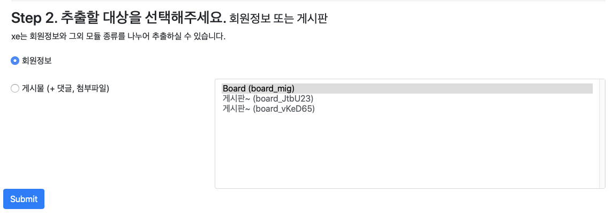
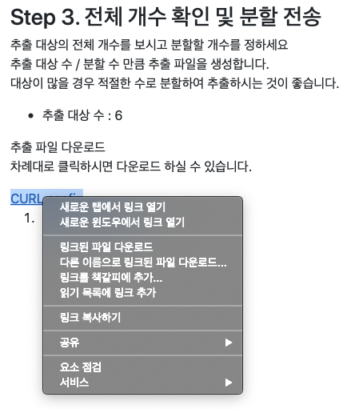
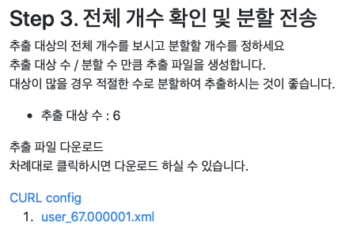
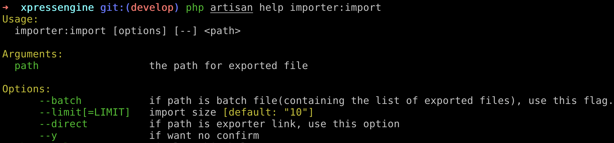
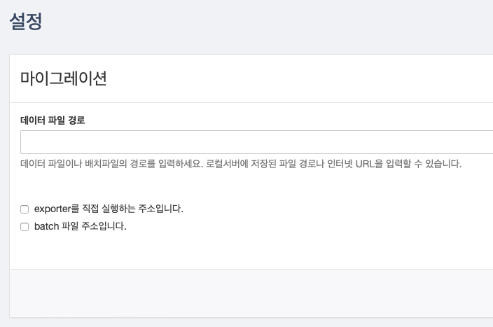

# importer

## XE1 데이터 migration
### **XE1 migration 플러그인 설치**

1. [https://github.com/xpressengine/xpressengine-migration](https://github.com/xpressengine/xpressengine-migration)

### XE1 migration 사이트 접속, 데이터 추출

#### 추출할 데이터 선택 (회원정보 / 게시판)
#### 게시판은 게시물 라디오 버튼 선택 후 오른쪽 게시판 목록에서 게시판 선택

#### 추출 데이터 선택

- 파일 다운로드 / URL 직접 전송 선택 가능
    - 파일 다운로드 : 파일명을 클릭해서 로컬에 파일 다운로드
    - URL 직접 전송 : import 하려는 파일 오른쪽 클릭 후 '링크 복사하기'

        

- 일괄 import / 분할 import 선택 가능
    - 일괄 import : 조회한 데이터를 모두 Import 하려면 CURL config 파일을 대상으로 작업
    - 분할 import : 조회한 데이터 중 분할 된 데이터를 import 하려면 CURL config 하단에 분할 파일을 대상으로 작업

## Data Import

### artisan 명령어를 통해서 import (권장)

- `php artisan importer:import <PATH> [options]`
    - --batch : 일괄 import를 할 경우 지정
    - --direct : URL을 통해서 직접 import 할 경우 지정
    - --y : 확인 메시지 없이 import 작업 진행

### 관리자 페이지에서 import

1. 설정→마이그레이션
2. 데이터 파일 경로
    - 데이터 파일 다운로드 후 import 할 경우 파일 path 지정
    - URL 직접 전송 으로 import 할 경우 URL 입력 후 'exporter를 직접 실행하는 주소입니다.' 체크박스를 체크
3. exporter를 직접 실행하는 주소입니다.
    - URL 직접 전송으로 Import 하는 경우 체크
4. batch 파일 주소입니다.
    - 일괄 import를 사용하는 경우 체크

